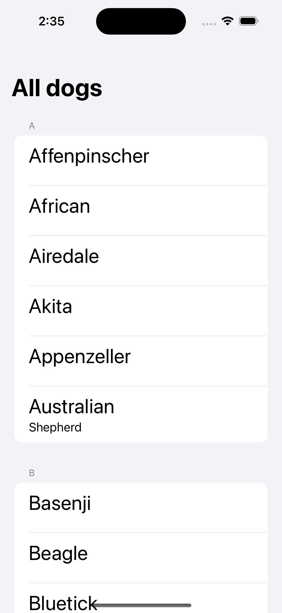
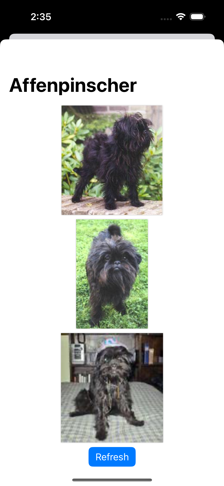
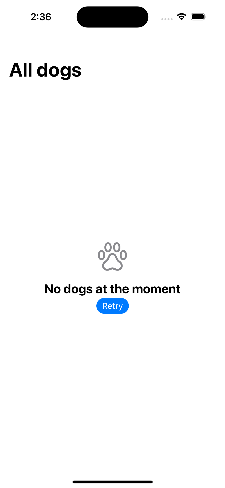

Some core screens:

 

## Table of contents
* [General info](#general-info)
* [Technologies](#technologies)
* [Design pattern chosen](#design-pattern-chosen)

## General info

This is a dog browser application to browse a list of different dogs and some images related to their breeds and serves as a Proof of Concept for testing the capabilities of one of the latest trends of design pattern in the iOS landscape that is The Composable Architecture (TCA).

It has the following capabilities:

- Browse through an extensive list of dog breeds sorted alphabetically along with their different types
- Display 3 random dog images associated to each one of those breeds that can be refreshed continuously to keep watching more doggo pictures
	
## Technologies
Xcode 15 was used for development of the application and the iOS Deployment is iOS 17.0 to make the most out of Apple's newest features.

Project is created with:
* SwiftUI
* TCA design pattern
* Swift Package Manager
* WWDC 2023 UIContentUnavailableConfiguration
* Dog API (https://dog.ceo/dog-api/)

## Design pattern chosen
The Composable Architecture was chosen as previous project experiences I've had and dealt with MVVM or MV have fallen short given the declarative paradigm such as SwiftUI offers, where views are a function of state and a pattern more akin to Redux would fit better to the desired high cohesion low coupling developers strive for in their codebases.

One of the biggest benefits I perceive from the pattern is that the State Management is fully scoped and encapsulated in Store classes when traditional SwiftUI patterns would have state properties all over the place on a view file: There could be multiple States, StateObjects, ObservedObjects and EnvironmentObjects. TCA packages all of this nicely in a Store class and allows for better decoupling and testability, even navigation for sheets and alerts is not only fully decoupled from views now but more easily testable as well.

Moreover, a welcome addition is that given how state management is handled inside the Store class of features withing an application, we don't have to worry as much over all the different property wrappers the Apple Model data framework offers (@State, @StateObject, @ObservedObject, @EnvironmentObject, @Environment, etc) and even the possibly more confusing macro @Observable that changes how some of the previous properties wrappers are interpreted and interacted. All state properties are stored simply in a Struct in TCA, easy as that.

All additional benefits and documentation can be found on [the TCA library's GitHub page](https://github.com/pointfreeco/swift-composable-architecture/tree/main) and a really great tutorial to quickly get into the pattern can be found [over here as well](https://pointfreeco.github.io/swift-composable-architecture/main/tutorials/meetcomposablearchitecture).

I think TCA is the proper next step up for SwiftUI projects, and it's a library that I would feel confident including on real life company projects as the team who conceived it, the [Point-Free](https://www.pointfree.co) team composed by Brandon Williams and Stephen Celis, are continously adding to the library and they are active answering and responding to questions in GitHub discussions. They've been sharing their knowledge at Point-Free for years now and I've no doubt they will keep on improving and expanding not only on iOS overall knowledge but on the TCA's library as well.
